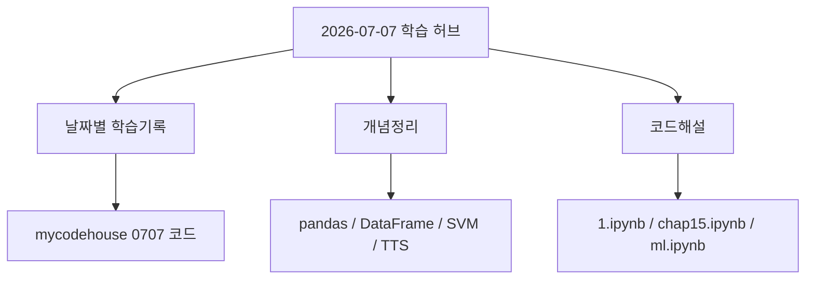

# 2026-07-07 학습 허브

> [!summary]
> 0707 학습 노트를 한 번에 이동하기 위한 허브 노트이다.  
> 오늘의 주제는 **외부 라이브러리**, **TTS**, **pandas 데이터 처리**, **Iris 머신러닝**, **Plotly 3D 시각화**이다.

## 바로가기

| 구분 | Obsidian 링크 | GitHub 코드/노트 링크 |
|---|---|---|
| 날짜별 학습기록 | [[2026-07-07]] | [GitHub 노트](../01_날짜별_학습기록/2026-07-07.md) |
| 개념정리 | [[0707_개념정리]] | [GitHub 노트](../02_개념정리/0707_개념정리.md) |
| 코드해설 | [[0707_코드해설]] | [GitHub 노트](../03_코드해설/0707_코드해설.md) |
| 원본 코드 폴더 | - | [mycodehouse 0707](https://github.com/rjsxo943-gif/mycodehouse/tree/main/0707) |

---

## 오늘 커밋/코드 파일 링크

| 파일 | 역할 | 링크 |
|---|---|---|
| `0707/1.ipynb` | TTS, 외부 라이브러리 실습 | [GitHub에서 보기](https://github.com/rjsxo943-gif/mycodehouse/blob/main/0707/1.ipynb) |
| `0707/chap15.ipynb` | pandas, numpy, Titanic 데이터 분석 | [GitHub에서 보기](https://github.com/rjsxo943-gif/mycodehouse/blob/main/0707/chap15.ipynb) |
| `0707/ml.ipynb` | Iris 데이터셋, SVM, Plotly 시각화 | [GitHub에서 보기](https://github.com/rjsxo943-gif/mycodehouse/blob/main/0707/ml.ipynb) |
| `source/titanic.csv` | pandas CSV 실습 데이터 | [GitHub에서 보기](https://github.com/rjsxo943-gif/mycodehouse/tree/main/source) |
| `news_Son.mp3` | TTS 결과물 | [GitHub에서 보기](https://github.com/rjsxo943-gif/mycodehouse/blob/main/news_Son.mp3) |

---

## 노트 연결 구조



---

## 핵심 개념 링크

- [[0707_개념정리#1. 외부 라이브러리|외부 라이브러리]]
- [[0707_개념정리#4. TTS|TTS]]
- [[0707_개념정리#5. pandas|pandas]]
- [[0707_개념정리#7. DataFrame|DataFrame]]
- [[0707_개념정리#12. pivot_table|pivot_table]]
- [[0707_개념정리#14. Iris 데이터셋|Iris 데이터셋]]
- [[0707_개념정리#16. SVM|SVM]]
- [[0707_개념정리#17. fit|fit()]]
- [[0707_개념정리#18. predict|predict()]]
- [[0707_개념정리#19. Plotly|Plotly]]

---

## 코드해설 링크

- [[0707_코드해설#1. gTTS로 음성 파일 만들기|gTTS 음성 파일 만들기]]
- [[0707_코드해설#3. Titanic CSV 파일 읽기|Titanic CSV 파일 읽기]]
- [[0707_코드해설#7. 데이터 통계 요약|describe() 해설]]
- [[0707_코드해설#9. pivot_table 만들기|pivot_table 해설]]
- [[0707_코드해설#13. Iris 데이터셋 불러오기|Iris 데이터셋 불러오기]]
- [[0707_코드해설#17. SVM 모델 생성과 학습|SVM 모델 생성과 학습]]
- [[0707_코드해설#20. Plotly 3D 산점도|Plotly 3D 산점도]]

---

## 오늘의 학습 흐름

```text
패키지 설치
→ import
→ 데이터 불러오기
→ DataFrame 정리
→ 모델 학습 fit()
→ 예측 predict()
→ 시각화 scatter_3d()
```

> [!tip]
> 오늘부터는 Python 문법만 보는 게 아니라, **라이브러리별 역할 분리**를 같이 기억해야 한다.

```text
데이터셋 로드 → sklearn.datasets
표 데이터 처리 → pandas
수치 계산 → numpy
머신러닝 모델 → sklearn.svm
시각화 → plotly.express
음성 변환 → gTTS
```

---

## 복습 체크리스트

- [ ] `pip install`과 `import` 차이 설명하기
- [ ] `.venv`와 `conda base`가 동시에 보일 때 왜 헷갈리는지 설명하기
- [ ] `Series`와 `DataFrame` 차이 설명하기
- [ ] `titanic["Age"]`, `titanic.describe()`, `titanic.iloc[]` 해석하기
- [ ] `pivot_table(index, columns, values, aggfunc)` 구조 설명하기
- [ ] `load_iris()`가 반환하는 데이터 구조 설명하기
- [ ] `fit()`과 `predict()` 차이 설명하기
- [ ] `pd.scatter_3d()`가 왜 틀렸는지 설명하기

---

## Dataview용 예시

> [!note]
> Dataview 플러그인을 켰을 때만 동작한다.

```dataview
TABLE date, type, status
FROM "01_날짜별_학습기록" OR "02_개념정리" OR "03_코드해설"
WHERE contains(tags, "python") OR contains(tags, "machine-learning")
SORT date DESC
```

---

## 관련 노트

- [[2026-07-07]]
- [[0707_개념정리]]
- [[0707_코드해설]]
- [[README]]

#bootcamp #python #pandas #machine-learning #tts
